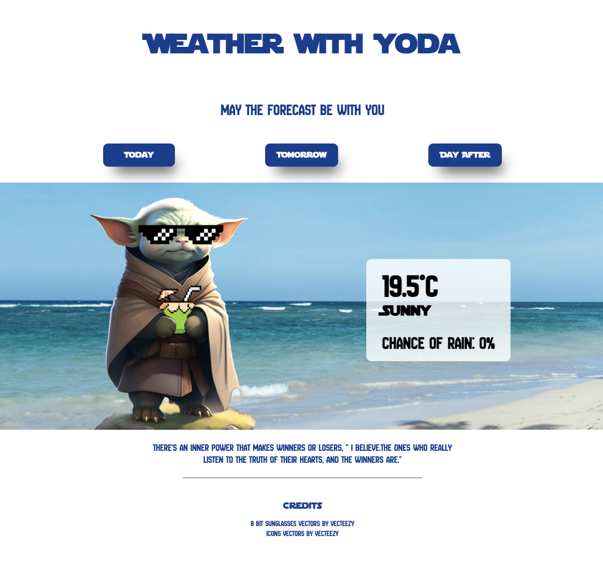

# Weather with Yoda

## May the forecast be with you

'Weather with Yoda' is the result of my first Hackathon at BrainStation's Software Engineering Bootcamp. The core functionality of this three-day forecast app was built within the time limit of six hours, and I have since added a couple of additions (the sound effects and a three additional weather backgrounds).

The requirement of the Hackathon was that we must use at least one external API. The APIs used for Weather with Yoda are:

- [Weather API](https://www.weatherapi.com/)
- [Quotes API (API Ninjas)](https://api-ninjas.com/api/quotes)
- [Yoda Translator (Fun Translations)](https://api.funtranslations.com/)

## Weather with Yoda Hompage

